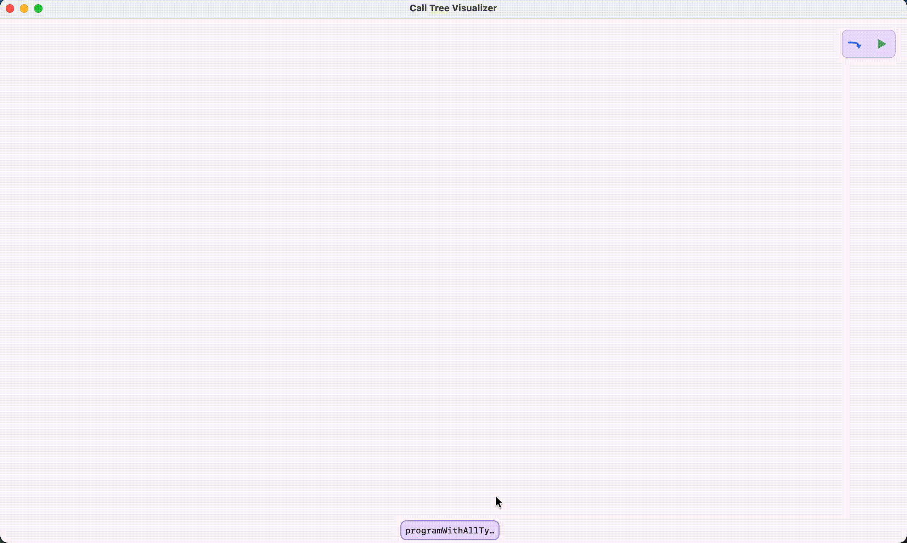

# Coroutine Call Tree Visualizer

**Educational tool for visualizing Kotlin Coroutine execution.**



This project is designed as an educational resource, specifically targeted at coroutine-related talks, workshops, and for anyone wanting to build a deeper mental model of how coroutines behave. It provides a real-time GUI that visualizes coroutine call trees, tracking function calls, exceptions, and cancellations across coroutines.

## Features

- **Real-time Visualization**: Watch the call tree grow and shrink as your coroutines execute.
- **Coroutine-aware Tracking**: Correctly handles suspension points and unstructured concurrency.
- **Exception & Cancellation Tracking**: Visualizes where exceptions are thrown and where coroutines are cancelled.
- **Customizable UI**: Support for Dark and Light themes.

## Usage in Talks & Education

This tool is especially useful for live demonstrations during talks or workshops. By visualizing the call tree, you can:
- **Demystify Structured Concurrency**: Show how child coroutines are tied to their parents.
- **Visualize Cancellation**: Demonstrate how cancellation propagates through the tree.
- **Explain Suspension**: See exactly when a coroutine suspends and resumes.
- **Debug Complex Flows**: Use it to explain complex asynchronous logic that is hard to follow in code alone.

## Project Structure

- [`:compiler-plugin`](compiler-plugin): The Kotlin compiler plugin that instruments code for tracking.
- [`:gradle-plugin`](gradle-plugin): A Gradle plugin to easily apply the compiler plugin to your projects.
- [`:stack-tracking-core-api`](stack-tracking-core-api): The runtime API used by instrumented code.
- [`:tracked-call-tree-as-flow`](tracked-call-tree-as-flow): Integration layer that converts tracking events into a Kotlin Flow.
- [`:call-tree-visualizer-gui`](call-tree-visualizer-gui): A Compose Multiplatform desktop application for visualizing the call tree.
- [`:examples`](examples): Example project demonstrating how to use the visualizer.

## How it works

The compiler plugin transforms every `suspend` function (unless marked with `@NonTracked`) to wrap its body with a call to `stackTracked`. This function uses a `StackTrackingContext` from the `CoroutineContext` to report when a function is entered, exited, or when it throws an exception.

## Usage

### 1. Apply the Gradle Plugin

Add the plugin to your `settings.gradle.kts`:

```kotlin
pluginManagement {
    repositories {
        gradlePluginPortal()
        mavenCentral()
    }
}
```

And in your `build.gradle.kts`:

```kotlin
plugins {
    id("com.woutwerkman.calltreevisualizer") version "0.0.1-2.2.20"
}
```

### 2. Instrumented Functions

By default, all `suspend` functions are instrumented. You can opt-out of tracking for specific functions using the `@NonTracked` annotation:

```kotlin
@NonTracked
suspend fun internalWork() {
    // This function won't appear in the call tree
}
```

### 3. Collecting Tracking Events

You can use the `trackingCallStacks` function to collect events as a Flow:

```kotlin
// Will print:
// Event type: CallStackPushType of function named fully.qualified.name.of.foo
// Event type: CallStackPopType of function named fully.qualified.name.of.foo
suspend fun main() {
    trackingCallStacks {
        foo()
    }.collect {
        println("Event type: ${it.eventType} of function named ${it.node.functionFqn}")
    }
}
```

For more advanced usage, see the detailed READMEs in the subprojects:
- [Compiler Plugin](compiler-plugin/README.md) - Details on how the code is transformed.
- [Core API](stack-tracking-core-api/README.md) - Information about annotations and the tracking interface.
- [GUI Visualizer](call-tree-visualizer-gui/README.md) - How to use the real-time visualization tool.

### 4. Running the Visualizer

You can use the `trackingCallStacks` function from the `:tracked-call-tree-as-flow` module to collect events and display them in the `CallTreeUI` provided by the `:call-tree-visualizer-gui` module.

See `examples/src/main/kotlin/com/woutwerkman/calltreevisualizer/Main.kt` for a complete example.

## Development

### Building

```bash
./gradlew build
```

### Testing

The project uses the Kotlin compiler test framework.
- Codegen tests: `compiler-plugin/testData/box`
- Diagnostic tests: `compiler-plugin/testData/diagnostics`

Run tests with:
```bash
./gradlew :compiler-plugin:test
```

---
**Note**: This is an educational project and is not intended for production use. It is optimized for clarity and visualization during presentations rather than performance.

Developed as a tool to better understand and explain complex Kotlin Coroutine interactions.
